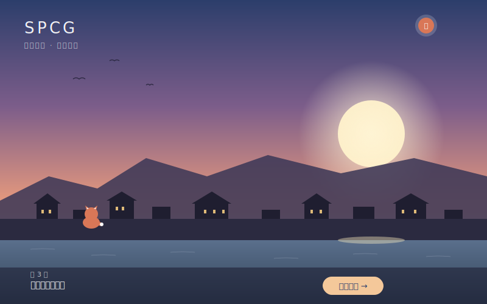
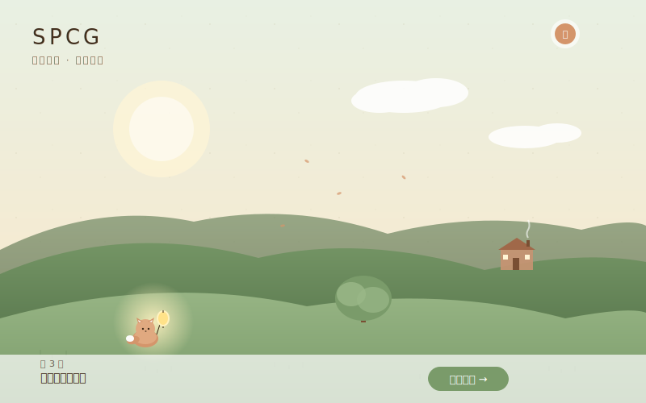
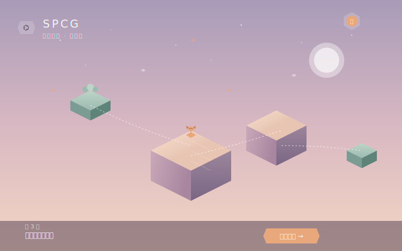

# SPCG 算法学习平台 · 设计建议书 v0.1

> 面向 10–18 岁中国中小学生、遵循 SPCG 自有 1–8 级能力路径的游戏化算法学习平台
> 起草人：Claude（与 Stephen 协作）　日期：2026 年 4 月 26 日
> 本稿为初版，用于与团队讨论后迭代

---

## 一、产品理念

### 1.1 起点

在 AI 大行其道的今天，孩子们越来越习惯让模型代替自己思考问题。"算法"——这个最能体现人类抽象能力、组合智慧、问题分解能力的核心技能——正在变成被忽视的基本功。

SPCG 不只是又一个少儿编程平台。它是一群从事算法教学多年的老师，用"作品"的态度，把算法之美亲手送到下一代手里——**作为计算机人对算法的一种敬意**。

### 1.2 三个关键词

- **情感**：每一个算法关卡都讲一个故事，让孩子记住的不只是代码，而是"我在那个雪夜帮迷路的小狐狸找回了家——靠的是 BFS"。
- **内涵**：知识点遵循 SPCG 自有 1–8 级能力路径，循序渐进，不为了游戏感而牺牲教学严谨性。
- **互动**：游戏画面只是"引子"，真正的体验在 IDE 里发生——优雅的编辑器、智能的提示、严肃但温柔的 OJ 判题。

### 1.3 与现有产品的差异化

| 维度 | 现有产品（猿编程 / 核桃 / CodeCombat） | SPCG |
|---|---|---|
| 教学侧重 | 编程语法、应用项目 | **算法本身**——抽象思维与问题求解 |
| 游戏 vs IDE | 游戏即教学，IDE 是辅助 | **IDE/OJ 是核心**，游戏是叙事载体 |
| 美学风格 | 卡通、鲜艳、刺激 | **柔和、动漫、治愈**——不疲劳、不焦虑 |
| 内容标准 | 自定课程体系 | 遵循 **SPCG 自有 1–8 级能力路径** |
| 价值导向 | "学会编程能找好工作" | "算法之美值得被看见" |

---

## 二、目标用户与教学知识点映射

### 2.1 用户分层

| 年龄段 | 学段 | SPCG 等级 | 心理特征 | 设计重点 |
|---|---|---|---|---|
| 10–11 岁 | 4–5 年级 | 1–2 级 | 喜欢故事和角色、尚无强抽象能力 | 重故事、重视觉、概念图形化 |
| 11–13 岁 | 6 年级–初一 | 3–4 级 | 抽象思维萌芽、追求"我能做到" | 引入数据结构、增加挑战 |
| 13–15 岁 | 初二–初三 | 5–6 级 | 自主性强、开始为目标学习 | 挑战导向、引入分治/搜索/树 |
| 15–18 岁 | 高中 | 7–8 级 | 接近真实竞赛水平 | 深度算法、性能优化、原创题 |

### 2.2 SPCG 1–8 级 → SPCG 关卡映射框架

> 注：以下为根据教学经验整理的初版映射，具体内容需与 SPCG 内部课程大纲逐条对齐。

**1 级（启蒙）**
- 知识点：变量、输入输出、顺序执行、简单数学运算、`if/else`、基础循环
- 关卡主题："**雾镇序章**"——主角小狐狸醒来，需要按照纸条上的步骤完成早晨的事
- 关卡数建议：12 关

**2 级（基础）**
- 知识点：嵌套循环、字符串、数组、基本函数、简单枚举
- 关卡主题："**镜湖小径**"——湖底有规律的星星图案，需要数清楚、找出来
- 关卡数建议：15 关

**3 级（结构化）**
- 知识点：一维/二维数组深入、字符串处理、函数参数传递、模拟、递推
- 关卡主题："**纸鸢城**"——风筝按风向飘移，需要预测路径
- 关卡数建议：18 关

**4 级（基础算法）**
- 知识点：排序（冒泡/选择/插入）、二分查找、简单贪心、模拟搜索
- 关卡主题："**钟楼之上**"——按时间顺序排列被风吹乱的回忆碎片
- 关卡数建议：20 关

**5 级（中级算法）**
- 知识点：分治、归并排序、快速排序、数论基础（GCD/LCM/质数）、组合数学
- 关卡主题："**繁星渡口**"——把无序星图分成两半各自整理
- 关卡数建议：22 关

**6 级（数据结构与搜索）**
- 知识点：栈、队列、链表、二叉树（前/中/后序）、DFS、BFS、哈夫曼树、二叉排序树
- 关卡主题："**森灵迷径**"——在树状的森林里找到回家的路（DFS）/ 用最少步数把信送达（BFS）
- 关卡数建议：25 关

**7 级（高级数据结构）**
- 知识点：图论基础、最短路（Dijkstra）、并查集、堆/优先队列、字符串匹配（KMP）
- 关卡主题："**潮汐群岛**"——在岛屿之间搭桥，规划最短的航线
- 关卡数建议：25 关

**8 级（动态规划与综合）**
- 知识点：动态规划（背包、最长公共子序列、最长上升子序列、区间 DP）、贪心进阶、复杂搜索剪枝、综合应用
- 关卡主题："**长夜灯塔**"——决定带哪些物资点亮一座座灯塔
- 关卡数建议：30 关

**总关卡数：约 167 关**，按每周 2–3 关的节奏，足够支撑 12–18 个月的完整学习路径。

---

## 三、游戏化教学机制

### 3.1 设计哲学：游戏是引导，IDE/OJ 是核心

**最重要的一句话**：每一关，孩子在游戏画面里停留的时间应该 **少于在 IDE 里停留的时间**。

游戏的作用是：
1. **包装动机**——把"完成两数交换"变成"帮小狐狸把两个袋子换位置"
2. **提供视觉反馈**——代码跑通后画面里的角色会回应（小狐狸开心地跳起来）
3. **承载叙事感**——让孩子记住"这一段经历"，而不只是"做对了一道题"

游戏不应该：
- 用花哨动画分散注意力
- 让通关靠点击而非思考
- 用奖励机制制造焦虑感（限时倒计时、随机抽卡等）

### 3.2 一节课的标准闭环

```
故事引入（1–2 分钟）
    ↓ 一段轻动画 + 旁白，引出本关问题
概念讲解（3–5 分钟）
    ↓ 老师角色（"算法导师"NPC）用图示讲核心概念
互动演示（2–3 分钟）
    ↓ 在 IDE 里用动画一步步演示算法运行
亲自编码（10–20 分钟）
    ↓ 学生在 IDE 里写代码、本地运行、看可视化
OJ 判题（3–5 分钟）
    ↓ 提交到 OJ，看到测试用例通过情况
复盘与拓展（2–3 分钟）
    ↓ 通过后解锁"导师讲解"和"高分技巧"
```

### 3.3 进阶机制

- **每一级**：完成约 80% 关卡解锁下一级
- **关卡内**：每个关卡有 3 颗星
  - ⭐ 通过所有测试用例
  - ⭐⭐ 在时间复杂度上达到目标（如 O(n log n)）
  - ⭐⭐⭐ 代码质量达标（命名、结构、无冗余）—— 由 AI 评分 + 老师审核结合
- **章节回顾关卡**：每完成一级有一个综合"故事关卡"，把本级所学算法组合应用

### 3.4 激励系统（克制为美）

**有：**
- 个人成长曲线图（按月看自己学过哪些算法）
- "算法师徒系统"——8 级毕业的孩子可以认领新生做"师弟师妹"，给新人留言鼓励
- 季节性章节（春樱、夏萤、秋枫、冬雪）—— 增加仪式感

**没有：**
- 排行榜（避免功利对比）
- 抽卡 / 皮肤付费
- "好友超过你了！"这类社交压力提示
- 倒计时 / 限时活动

### 3.5 社交（轻量）

- 关卡通关后可以**写一句"通关感言"**，其他孩子能看到
- 卡住时可以**求助"提示"**——不是直接给答案，而是给一段鼓励 + 解题方向
- 老师/家长可以看到孩子的学习曲线，但**不能看到具体代码**（保护孩子的探索空间）

---

## 四、美术与音乐风格

### 4.0 三个候选方向（请先选定一个再深入）

下面是三种差异明显的主界面风格 mockup。**注意**：这是用 SVG 绘制的"概念示意图"，不是最终美术——它的作用是定**色调、构图、情绪走向**。定下方向后，再请专业美术做高精度的概念稿与立绘。

请重点感受三者在以下三个维度的差异：
- **色彩**：是冷色系（深蓝紫）还是暖色系（米白绿）还是冷暖混合
- **构图**：景深 / 平面 / 几何
- **情绪**：诗意感伤 / 温暖治愈 / 冷静思考

#### 方向 A · 新海诚 · 「黄昏雾镇」



- **色调**：黄昏紫 + 落霞橘 + 深蓝水面，戏剧性更强
- **情绪**：略带感伤的诗意、"远行的少年" 感
- **优点**：辨识度极高，画面美到能截图分享；天空 + 倒影是最容易出爆款 KV 的方向
- **风险**：色彩饱和度偏高，长时间盯着可能产生情绪疲劳；与"专注编程" 的状态有微妙张力
- **适合人群**：偏文艺、内向、在意"画面美" 的孩子

#### 方向 B · 吉卜力 · 「晨雾村落」



- **色调**：米白 + 雾松绿 + 暖橘灯笼，整体温润
- **情绪**：温暖、踏实、"回到家了" 的安全感
- **优点**：色彩压力最小，最适合长时间陪伴的学习产品；与"算法之美" 的安静气质最贴合；家长接受度最高
- **风险**：辨识度不如 A 方向高；如果美术功力不到位，容易"看起来像一般绘本"
- **适合人群**：广谱适配，从小学到高中都不会跳戏 — **我个人最推荐**

#### 方向 C · 纪念碑谷 · 「几何之境」



- **色调**：薄樱粉 + 雾紫 + 薄荷绿，清淡通透
- **情绪**：冷静、抽象、"思考者的世界"
- **优点**：与"算法 = 抽象结构" 的内核最匹配；视觉上最"高级"；最不容易过时；做高级关卡的可视化（图论、DP 状态转移）天然契合
- **风险**：缺少"角色温度"，10 岁左右的孩子可能觉得冷；不利于讲故事
- **适合人群**：13 岁以上、追求"酷" 的孩子；同时也是品牌官网/PR 物料最好用的方向

---

**我的综合建议**：
- **主产品** 用 **方向 B（吉卜力）** 作为基础调性 — 温暖、广谱、耐看
- **品牌物料 / 高年级关卡可视化** 借鉴 **方向 C（几何）** 的元素 — 比如树和图算法的可视化用几何风
- **方向 A（新海诚）** 留作 "重要章节过场动画" 的视觉语言 — 偶尔出现一次，每次都印象深刻

但这只是一个起点。请你和团队感受一下三张图的实际观感（**重点看色调和情绪，不要看 SVG 的细节质感**），告诉我：
1. 哪一个方向你的第一感觉最对？
2. 三张里有什么元素是你想保留 / 想去掉的？
3. 团队里有人能画概念图吗？还是要请外部美术？

---

### 4.1 视觉基调：柔和治愈（无论选哪个方向都坚持的原则）

**关键词**：水彩感、清晨光、淡雾、纸的质感

**参考方向**：
- 新海诚的天空和光感（不要过度饱和的霓虹）
- 吉卜力的角色亲和力与生活感
- 《纪念碑谷》的几何美与沉稳配色
- 《Sky 光遇》的环境氛围与"无敌意"世界观
- 中国传统绘本（如熊亮《和风一起散步》）的水彩晕染

### 4.2 角色

**主角：小狐狸"卯之"**（10 岁孩子的化身）
- 性格：好奇、害羞、坚持
- 不会说话，用表情和动作沟通——避免文字过多

**算法导师 NPC**：
- 1–4 级：白发老猫"先生"，慢声细语
- 5–8 级：年轻的"游学者"狼隼，更像同行的伙伴

**配角**：每一级的关卡里有一两个反复出现的"小同伴"，让孩子产生情感连接

### 4.3 色彩规范

| 用途 | 色调建议 |
|---|---|
| 主背景 | 米白 / 雾蓝 / 暖灰，避免纯白 |
| 主色 | 雾松绿 #6B8E7F / 落霞橘 #D9A38A |
| 辅色 | 云母灰 / 薄樱粉 |
| 强调（成功通关） | 暖金光，**不闪不抖** |
| 错误反馈 | 不用红色，用"小狐狸蹙眉"+ 温暖琥珀色 |

### 4.4 排版与字体

- 中文：思源宋体（叙事段落）+ 思源黑体（界面）
- 代码：JetBrains Mono / Sarasa Mono
- 行距宽松，避免压迫感

### 4.5 音乐与音效

- 主题旋律：钢琴 + 弦乐 + 风铃，参考《天空之城》《君の名は》
- 关卡内：白噪音 + 极轻氛围乐，让孩子能专注
- 通过音效：一声木铃，**不要游戏化的"金币音"**
- 失败音效：温柔的水滴声，不刺激

---

## 五、核心引擎：IDE + OJ

### 5.1 IDE 设计原则

**这是 SPCG 的灵魂。** 投入的资源应该多于游戏部分。

**基础**：
- 基于 **Monaco Editor**（VS Code 同款内核）
- 支持 **C++ 与 Python** 双语言（对应 SPCG 双语言路径）
- 暗色主题 + 浅色主题，**默认浅色**（与游戏画面调性一致）

**为青少年优化**：
- **分级智能提示**
  - 1–2 级：手把手提示，每写一行有"导师"评论
  - 3–5 级：常规自动补全
  - 6–8 级：完全靠自己，但保留语法检查
- **算法可视化嵌入式面板**
  - 写排序时可以一键打开"看自己的算法是怎么动的"
  - 写树/图算法时可以可视化遍历过程
  - 这是 SPCG 区别于普通 OJ 的核心体验
- **本地试运行**
  - 在浏览器内（WebAssembly 跑 C++、Pyodide 跑 Python）
  - 不联网就能试错，鼓励反复尝试

**情感化细节**：
- 编辑器顶部有一只小狐狸"卯之"陪着，思考时它会眨眼
- 卡 5 分钟以上，会出现一句温柔的提示："要不要喝口水休息一下？"

### 5.2 OJ 判题引擎

**架构建议**：自建 + Judge0 二选一
- **方案 A**：基于开源 [Judge0](https://github.com/judge0/judge0) 二次开发，快速起步
- **方案 B**：自建沙盒（Docker + isolate），长期可控，但开发成本高

建议 **MVP 用 Judge0，v1.0 后逐步替换**。

**多维评测**（这是 SPCG 的差异化）：

| 维度 | 说明 | 给孩子的反馈 |
|---|---|---|
| 正确性 | 通过测试用例数 | "你帮 9/10 只小狐狸找到了家！" |
| 时间 | 是否在时间限制内 | "你的方法很机灵！再快一点就完美了" |
| 空间 | 是否在内存限制内 | （高级关卡才显示） |
| 代码质量 | 命名 / 嵌套深度 / 重复代码 | "代码读起来像散文一样清楚" |
| 算法识别 | AI 识别用的什么算法 | "你用了贪心策略！下一关试试动态规划？" |

**错误反馈的语言学**：
- 不说"Wrong Answer"，说"还差一点点"
- 不说"Time Limit Exceeded"，说"想得很到位，但思路上还能更巧妙"
- 不说"Compilation Error"，说"小狐狸还没看懂这段——第 12 行可能少了个分号？"

**测试用例分级**：
- **基础用例**（公开）：1–3 个，用于教学
- **挑战用例**（隐藏）：5–10 个，覆盖边界
- **彩蛋用例**（仅 ⭐⭐⭐ 用）：1 个特别难的，过了有特殊故事

### 5.3 防作弊与 AI 时代的应对

- 提交代码时记录**编辑过程**（按键节奏、粘贴检测）
- 直接 Ctrl+V 大段代码会触发友好提醒："看起来这段是直接贴进来的，要不要自己写写看？"
- **不禁止**孩子用 AI 辅助（这违背时代），而是要求他们能**用自己的话讲一遍算法**才能拿星
  - 通过关卡后弹一道"口述题"：录一段 30 秒语音说说自己的思路（可选，加分项）

---

## 六、典型用户旅程

### 6.1 第一次登录

1. 不用注册，先体验一关（"雾镇序章" 第一关）
2. 通关后才提示"留个名字记下你的旅程？"
3. 引导关注"导师角色"+ "学习节奏建议"

### 6.2 一周的节奏

- **周一/三/五**：1 关新内容（约 30 分钟）
- **周末**：1 关挑战 + 看自己一周的成长曲线
- **每月最后一周**：综合关卡 + 给"师弟"留言

### 6.3 一年的成长

- 第 1–3 月：1–2 级（启蒙）
- 第 4–6 月：3–4 级（基础算法）
- 第 7–9 月：5–6 级（数据结构与搜索）
- 第 10–12 月：7 级 + 8 级前半段（高级算法）

家长能看到的"成长报告"：
- 学会了哪些算法（用孩子能理解的语言描述）
- 总学习时长 / 思考时间分布
- "孩子最有 aha 时刻" 的 3 个关卡

---

## 七、技术栈建议

| 层 | 选型 | 理由 |
|---|---|---|
| 前端框架 | Next.js 14 + React | 生态成熟，易招人，SEO 友好 |
| 编辑器 | Monaco Editor | VS Code 同款，体验顶级 |
| 算法可视化 | D3.js + 自研动效层 | 灵活控制视觉风格 |
| 浏览器内运行 C++ | Emscripten / cppyy | 减少服务端压力，鼓励试错 |
| 浏览器内运行 Python | Pyodide | 同上 |
| 游戏画面 | PixiJS（2D）或 Phaser | 轻量、不抢编辑器资源 |
| 后端 | Node.js + NestJS / Go | 看团队熟悉度 |
| OJ 判题 | Judge0（MVP）→ 自研沙盒（长期） | 快起步，再迭代 |
| 数据库 | PostgreSQL + Redis | 标准组合 |
| 部署 | 国内：阿里云 / 腾讯云 ；海外：Vercel + AWS | 双区域，照顾华人海外用户 |
| 监控/分析 | 自建埋点 + 教学指标 dashboard | 关注**孩子是否真的学会**，而非 DAU |

---

## 八、MVP 范围与上线节奏

### 8.1 MVP（建议 3 个月做完）

- **1 级 12 关 + 2 级 15 关 全部内容做透**（共 27 关）
- IDE 完整可用（双语言、可视化、本地运行）
- OJ 判题（Judge0 接入即可）
- "雾镇 / 镜湖" 两个章节的美术 + 音乐
- 注册 / 进度 / 成长曲线
- 家长查看页面（v0 极简）

**目标**：邀请 30–50 个目标用户（你和团队认识的孩子）做 4 周深度测试

### 8.2 MVP 关键指标（不看 DAU，看**学会率**）

- **关卡通过率**：每关通过率应在 60–80% 之间（过低则太难，过高则太水）
- **平均尝试次数**：3–8 次为健康（说明孩子在思考）
- **第 7 天留存**：≥ 60%（口碑产品）
- **完成 1 级到 2 级的转化**：≥ 70%
- **家长 NPS**：≥ 40

### 8.3 v1.0（上线后 6 个月）

- 完成 3–4 级内容
- 增加"老师后台"，让小型培训机构可以用
- 上线 iPad 版（专注模式）

### 8.4 v2.0（12 个月）

- 5–8 级全部完成
- 开放"师徒系统"
- 内容创作工具：让 8 级毕业生自己出题贡献到平台

---

## 九、给团队的若干提醒

1. **不要急着上 AI 聊天功能**。AI 让孩子习惯"问而不思"，与项目初心相悖。AI 应该作为"判题官的一部分"在背后工作，而不是在前台替孩子说话。

2. **每一关必须由真正懂算法的老师亲自设计文案与故事**。这不能外包，否则 SPCG 就会变成又一个"穿了好看皮的题库"。

3. **美术要早早请专业团队，不要凑合**。柔和治愈风的难点不在工作量，在审美统一。早期定下"风格圣经"非常重要。

4. **不要做"一个 App 解决所有"**。先把 Web 版做扎实——孩子学习算法在大屏更合适，移动端是后话。

5. **建议建立"教学顾问委员会"**：3–5 位有 OI 经验或长期一线教学的老师，每月看一次产品打分。

---

## 十、下一步讨论清单

请你和团队就以下问题先在内部讨论一轮，下次我们一起细化：

**理念层**
1. "对算法的敬意" 这个核心理念，团队成员认不认同？需要多大程度地体现在用户可见的地方？
2. 商业模式：免费 + 增值？按等级付费？面向 B 端培训机构？

**内容层**
3. C++ 与 Python 谁先做？还是同步推进？（建议先 Python，门槛低 + 1–2 级的孩子更易上手）
4. SPCG 1–8 级能力路径是否需要外部教研顾问参与共建？
5. 167 关的工作量（每关需要：故事、关卡设计、动画、测试用例、AI 提示词、复盘文案）—— 团队估算每周能产出几关？

**技术层**
6. 团队当前的技术栈与人员构成？以上的技术选型是否要根据团队实际能力调整？
7. 服务器选址：先做大陆为主，还是大陆 + 海外双区？

**节奏层**
8. 你心目中的 MVP 上线时间是？（建议 2026 年 8–9 月，正好暑期/秋季招生窗口）
9. 团队规模：研发几人、设计几人、内容几人、运营几人？

**测试用户**
10. 第一批 30–50 个测试孩子，你打算从哪里来？

---

> *"算法是计算机人写给世界的诗。我们要做的，是把这首诗，用孩子能听懂的方式，再吟一遍。"*

— SPCG 起草说明 v0.1
